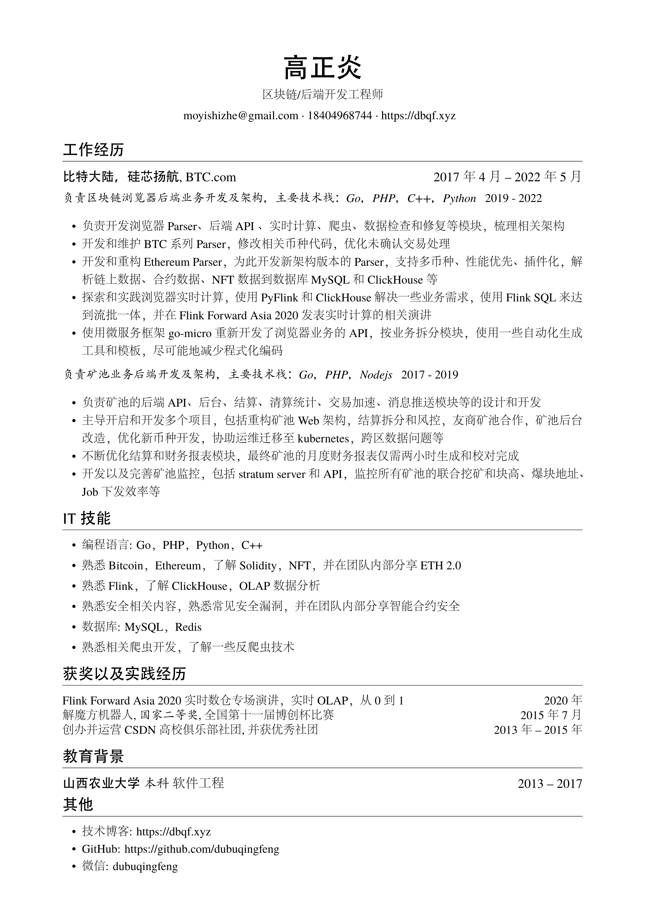

# 一些LaTeX简历

## 前言

又是一年求职季，又是一年校招时。

求职有一份整洁，大方的技术简历是很重要的。

并且内容不要超过一页A4纸。

于是就有了整理一些模版的想法。

并且主要是LaTeX简历。

并且也有自动在线生成LaTeX的网站。

[在线网站示例一](https://www.sharelatex.com/project/57635591e3290b0b4d4ec9ce)

<!--将要添加一些动画。-->

## 截图

简历一：

## 使用方法

## 致谢

[一个简洁优雅的 XeLaTeX 简历模板](https://github.com/billryan/resume/tree/zh_CN)

## 后记

十年寒窗，一朝基业。

一分耕耘，一分收获。

路途漫漫，仅此共勉。
